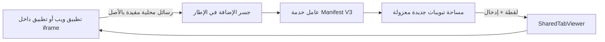

# chromium-web-embed

> **مساحة Chrome مُدارة، مرئية، ومعزولة بالأصل لتطبيقات الويب ووكلاء الذكاء الاصطناعي.**

`chromium-web-embed` هي مكتبة TypeScript وإضافة Chrome من نوع Manifest V3. تمنح تطبيق الويب مساحة تبويبات جديدة يملكها التطبيق نفسه، ثم تعرض التبويب النشط داخل واجهته وترسل إليه تفاعلات المستخدم أو الوكيل محليًا. لا تمر الجلسة عبر خادم وسيط، ولا تستطيع المكتبة رؤية تبويبات المستخدم القائمة أو كلمات مروره أو محتوى DOM.

| الإصدار | حالة النطاق | الترخيص | التنزيل |
| --- | --- | --- | --- |
| **3.0.0** | مساحة مُدارة فقط | MIT | [ملف الإضافة ZIP](https://github.com/MOHOAI/chromium-web-embed/raw/refs/heads/main/extension-download/real-browser-web-bridge-extension.zip) |

## لماذا هذه المكتبة؟

تطبيقات الويب لا تستطيع تضمين المواقع الأخرى بحرية بسبب سياسات المتصفح. يعالج `chromium-web-embed` هذه المشكلة بنموذج مرئي ومحلي: تنشئ الإضافة تبويبات جديدة للموقع المتصل، ويعرض `SharedTabViewer` لقطات دورية للتبويب المُدار ويرسل أحداث الإدخال إليه عبر Chrome DevTools Protocol. يبقى المستخدم داخل Chrome، ويرى التبويبات التي أنشأها التطبيق، ويمكنه إيقاف مساحة العمل أو تحكم الوكيل بوضوح.



## ما الجديد في 3.0.0

يدعم الإصدار **3.0.0** التطبيقات التي تعمل داخل `iframe`. يُثبت جسر الإضافة داخل كل إطار HTTP(S) مؤهل، ويُعرّف مساحة العمل بحسب **أصل التطبيق داخل الإطار** وليس أصل الصفحة الحاوية. لذلك يستطيع التطبيق المضمّن استدعاء المكتبة مباشرة، من دون قناة `postMessage` مع الأب ومن دون مشاركة صلاحيات الأب أو مساحته.

| السيناريو | السلوك في 3.0.0 |
| --- | --- |
| التطبيق يعمل كصفحة رئيسية | ينشئ مساحة مرتبطة بأصل الصفحة. |
| التطبيق يعمل داخل `iframe` من أصل آخر | ينشئ مساحة مستقلة مرتبطة بأصل الإطار. |
| الصفحة الحاوية تحاول التحكم بمساحة الإطار | غير مسموح؛ لا توجد صلاحية ضمنية بين الأصلين. |
| الإطار يستقبل تحديثات مساحة عمله | تصل الأحداث إلى `frameId` الصحيح فقط. |
| إطار sandbox بلا `allow-same-origin` | غير مدعوم عمدًا لأن أصله مبهم ولا يمكن التحقق منه. |

> **القاعدة الأمنية:** تضمين التطبيق لا يمنح الصفحة الحاوية حق التحكم به. كل إطار يتصل بجسره المحلي فقط، ويستطيع إنشاء وإدارة التبويبات الموجودة في مساحة أصله فقط.

## القدرات والحدود

| متاح داخل مساحة التطبيق | غير متاح إطلاقًا عبر هذه المكتبة |
| --- | --- |
| إنشاء مجموعة تبويبات، فتحها، إغلاقها، وإعادة تسميتها | استعراض تبويبات المستخدم القائمة أو إدارتها |
| تنقل، رجوع، تقدم، إعادة تحميل، تثبيت، كتم، ونسخ تبويبات المساحة | قراءة كلمات المرور أو ملفات تعريف الارتباط أو DOM |
| نقر أيسر/أيمن/مزدوج/ثلاثي، تمرير، تحويم، كتابة، حذف، قص/نسخ/لصق | التحكم بسطح المكتب أو التطبيقات الأصلية |
| لقطات عرض متدرجة ومقاييس أداء وسجل نشاط محلي للوكيل | تنفيذ JavaScript اعتباطي داخل المواقع |
| وكيل ذكاء اصطناعي بعد تفعيل صريح من المستخدم | إعادة تنفيذ الأوامر المتغيرة تلقائيًا بعد انقطاع الاتصال |

## التثبيت

### 1. ثبّت الإضافة محليًا

نزّل [ملف الإضافة](https://github.com/MOHOAI/chromium-web-embed/raw/refs/heads/main/extension-download/real-browser-web-bridge-extension.zip)، ثم فك ضغطه وافتح `chrome://extensions`. فعّل **وضع المطور**، واختر **تحميل بدون حزمة** وحدد المجلد المفكوك. أعِد تحميل تطبيقك بعد تفعيل الإضافة.

### 2. أضف المكتبة إلى التطبيق

```bash
npm install github:MOHOAI/chromium-web-embed
```

## البدء السريع

```ts
import { RealBrowserClient, SharedTabViewer } from "chromium-web-embed";

const browser = new RealBrowserClient();
await browser.waitForExtension();

const { tab } = await browser.createWorkspace({
  label: "تطبيقي",
  url: "https://example.com",
  agentControl: false,
});

const viewer = new SharedTabViewer(
  browser,
  document.querySelector<HTMLElement>("#managed-tab")!,
  { renderProfile: "balanced", onError: console.error },
);
await viewer.start();

await browser.navigateInWorkspace(tab.id, "https://example.com/docs");

// عند إلغاء تركيب المكون:
viewer.dispose();
await browser.closeWorkspace();
browser.dispose();
```

## تطبيق داخل iframe

يحمّل **التطبيق المضمّن نفسه** المكتبة وينشئ العميل. لا يمرر الأب كائن عميل، ولا يحتاج التطبيق إلى الوصول إلى `window.parent`.

```html
<!-- في الموقع الحاوي: لا تمنح هذه الوسمة صلاحية إضافية للأب. -->
<iframe
  src="https://widget.example/app"
  title="تطبيق متصفح مستقل"
  allow="clipboard-read; clipboard-write"
  sandbox="allow-scripts allow-same-origin"
></iframe>
```

```ts
// داخل https://widget.example/app فقط
import {
  createEmbeddedBrowserClient,
  getEmbeddedApplicationContext,
} from "chromium-web-embed";

const context = getEmbeddedApplicationContext();
console.info(context.embedded, context.origin); // true, https://widget.example

const browser = createEmbeddedBrowserClient();
await browser.waitForExtension();
await browser.createWorkspace({ label: "مساحة Widget" });
```

راجع [دليل التطبيقات المضمّنة](docs/guides/embedded-apps.md) لنموذج React، وقيود `sandbox`، وخطوات التشخيص.

## تحكم الوكيل

تحكم الوكيل محصور في مساحة التطبيق المُدارة ويتطلب موافقة صريحة من المستخدم. تُسجل العمليات محليًا، ولا يُعاد تنفيذ الأوامر المتغيرة تلقائيًا بعد فقد الاتصال.

```ts
import { createManagedBrowserAgent } from "chromium-web-embed";

await browser.setAgentControl(true);
const agent = createManagedBrowserAgent({ client: browser });

await agent.open("https://example.com");
await agent.click(420, 260);
await agent.type("بحث تجريبي");
await agent.clear();
await agent.type("بحث جديد");
console.table(agent.getActivityLog());

await browser.setAgentControl(false);
```

## واجهة API

| التصدير | الاستخدام |
| --- | --- |
| `RealBrowserClient` | اتصال مباشر عندما يكون التطبيق صفحة رئيسية. |
| `createEmbeddedBrowserClient()` | اتصال إطار مستقل بأصل الإطار فقط. |
| `getEmbeddedApplicationContext()` | تشخيص موضع التطبيق داخل إطار دون قراءة حالة الأب. |
| `SharedTabViewer` | عرض اللقطة وتمرير الإدخال إلى تبويب المساحة النشط. |
| `ManagedBrowserAgent` | تنفيذ أوامر الوكيل بعد موافقة المستخدم. |
| `getConnectionDiagnostic()` | قراءة حالة الجسر والتعافي من انقطاعه. |

## أدلة التكامل

| الدليل | الوصف |
| --- | --- |
| [JavaScript مباشر](docs/guides/plain-javascript.md) | صفحة HTML أو تطبيق JavaScript بسيط. |
| [React](docs/guides/react.md) | تركيب العارض وإدارته ضمن دورة حياة React. |
| [التطبيقات المضمّنة](docs/guides/embedded-apps.md) | الوصول الآمن من `iframe` في الإصدار 3.0.0. |
| [وكلاء الذكاء الاصطناعي](docs/guides/ai-agent.md) | موافقات، سجل نشاط، وأوامر محصورة. |
| [تنسيق الخادم](docs/guides/backend-coordination.md) | فصل نية الخادم عن تنفيذ العميل المحلي. |
| [الأخطاء الشائعة](docs/troubleshooting.md) | تشخيص الإضافة والعارض والإدخال. |
| [الأداء والاعتمادية](docs/performance-reliability.md) | ملفات العرض والمقاييس وسياسة إعادة الاتصال. |

## الأمان والخصوصية

يقبل الجسر الأوامر الموقعة ببروتوكول الإصدار 3 من نفس أصل الإطار فقط، ويشتق عامل الإضافة الملكية من عنوان **المستند المرسل**. تُوجّه الأحداث إلى الإطار المشترك نفسه عبر `frameId`. يجب أن يستخدم ناشرو الإضافة في البيئات الإنتاجية قائمة `allowedOrigins` دقيقة في Manifest بدل الأنماط الواسعة، وأن يعرض التطبيق عنصر تحكم مرئيًا لتفعيل أو تعطيل تحكم الوكيل.

تحتاج الإضافة إلى `tabs` و`tabGroups` و`debugger` و`scripting` و`storage` لتنشئ مساحة العمل المرئية، تلتقط إطار العرض، وترسل التفاعل إلى تبويبات تلك المساحة. لا توفر هذه الصلاحيات API لقراءة كلمات المرور أو ملفات تعريف الارتباط أو DOM.

## التطوير والتحقق

```bash
npm install
npm run typecheck
npm test
npm run build
npm run pack:check
```

ينشئ `npm run build` مجلد `extension/` وملف التنزيل `extension-download/real-browser-web-bridge-extension.zip`.

## المراجع

- [Chrome Debugger API](https://developer.chrome.com/docs/extensions/reference/api/debugger)
- [Chrome Tabs API](https://developer.chrome.com/docs/extensions/reference/api/tabs)
- [Chrome Tab Groups API](https://developer.chrome.com/docs/extensions/reference/api/tabGroups)
- [رسائل إضافات Chrome](https://developer.chrome.com/docs/extensions/develop/concepts/messaging)

## الترخيص

MIT. راجع [LICENSE](LICENSE).
